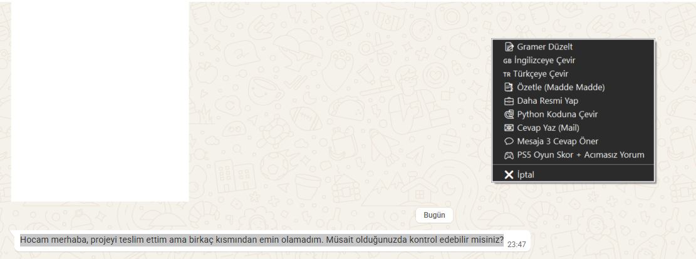
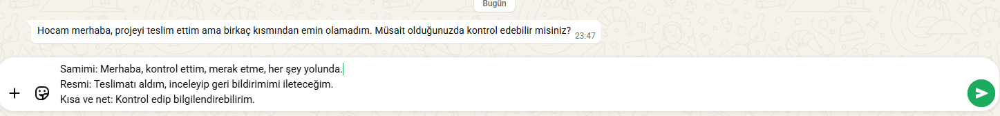
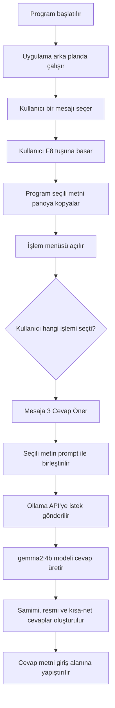
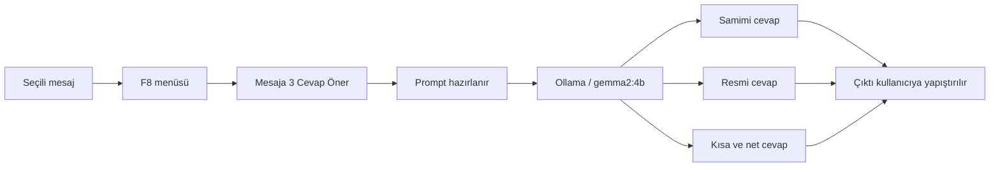

# AI Asistan — Mesaja 3 Cevap Öner

Bu proje, bilgisayarda seçilen bir metni `F8` kısayolu ile yapay zekâya gönderen ve seçilen işleme göre hızlı çıktı üreten masaüstü yardımcı uygulamasıdır.

Bu sürümde projeye tek satırlık yeni bir özellik eklenmiştir:

```python
"💬 Mesaja 3 Cevap Öner": "Seçili metni bana gelen bir mesaj olarak kabul et. Bu mesaja verilebilecek 3 kısa cevap üret: 1) Samimi, 2) Resmi, 3) Kısa ve net. Her başlık altında yalnızca 1 cevap yaz. Cevaplar mesajın içeriğine uygun olsun. Gereksiz açıklama, markdown, yıldız, emoji ve tekrar kullanma. Sadece şu formatta cevap ver: Samimi: ... Resmi: ... Kısa ve net: ...",
```

Bu özellik, seçili bir mesaja karşı **samimi**, **resmi** ve **kısa-net** olmak üzere üç farklı cevap önerisi üretir.

---

## Projenin Amacı

Günlük hayatta WhatsApp, e-posta, okul grubu veya iş mesajlarına cevap verirken bazen mesajı nasıl yazacağımıza karar veremeyiz.

Örneğin kullanıcıya şöyle bir mesaj gelmiş olabilir:

```text
Hocam merhaba, projeyi teslim ettim ama birkaç kısmından emin olamadım. Müsait olduğunuzda kontrol edebilir misiniz?
```

Kullanıcı bu mesajı seçip `F8` tuşuna bastığında uygulama işlem menüsünü açar. Menüden **Mesaja 3 Cevap Öner** seçildiğinde yapay zekâ aynı mesaja üç farklı tarzda cevap üretir:

```text
Samimi: Merhaba, kontrol ettim, merak etme, her şey yolunda.

Resmi: Teslimat aldım, inceleyip geri bildirimimi ileteceğim.

Kısa ve net: Kontrol edip bilgilendirebilirim.
```

Bu sayede kullanıcı aynı mesaja farklı tonlarda hızlı cevap hazırlayabilir.

---

## Eklenen Özellik

| Özellik | Açıklama |
|---|---|
| `💬 Mesaja 3 Cevap Öner` | Seçili mesaja samimi, resmi ve kısa-net olmak üzere 3 farklı cevap üretir. |

Bu özellik özellikle şu durumlarda kullanılabilir:

- WhatsApp mesajlarına hızlı cevap yazma
- Hocaya veya öğrenciye cevap önerisi üretme
- İş mesajlarında daha resmi bir cevap hazırlama
- Kısa ve net cevap alternatifi oluşturma
- Aynı mesajı farklı iletişim tonlarında değerlendirme

---

## Ekran Görüntüleri

> Görsellerin README içinde görünmesi için ekran görüntülerini proje içinde `assets/` klasörüne koyun.

### 1. F8 Menüsünde Yeni Özellik

Aşağıdaki ekran görüntüsünde kullanıcı WhatsApp Web üzerinde bir mesajı seçmiştir. `F8` tuşuna basıldığında uygulamanın işlem menüsü açılmıştır. Menüde yeni eklenen **Mesaja 3 Cevap Öner** seçeneği görünmektedir.



---

### 2. Girdi ve Çıktı Örneği

Kullanıcı mesajı seçip **Mesaja 3 Cevap Öner** işlemini çalıştırdığında uygulama, aynı mesaja üç farklı tarzda cevap üretir.



Ekran görüntüsündeki örnek akış:

**Seçilen mesaj:**

```text
Hocam merhaba, projeyi teslim ettim ama birkaç kısmından emin olamadım. Müsait olduğunuzda kontrol edebilir misiniz?
```

**Üretilen çıktı:**

```text
Samimi: Merhaba, kontrol ettim, merak etme, her şey yolunda.

Resmi: Teslimat aldım, inceleyip geri bildirimimi ileteceğim.

Kısa ve net: Kontrol edip bilgilendirebilirim.
```

---

## Kullanım Akışı

1. Program çalıştırılır.
2. Kullanıcı herhangi bir uygulamada bir mesajı seçer.
3. `F8` tuşuna basar.
4. Açılan menüden **Mesaja 3 Cevap Öner** seçeneğini seçer.
5. Seçili metin Ollama üzerinden yerel LLM modeline gönderilir.
6. Model üç farklı cevap üretir.
7. Üretilen cevap metni giriş alanına yapıştırılır.

---

## Çalışma Mantığı

Uygulama arka planda çalışır ve `F8` tuşunu dinler. Kullanıcı bir metni seçip `F8` tuşuna bastığında program seçili metni otomatik olarak kopyalar. Ardından kullanıcıya işlem menüsü gösterilir. Menüden seçilen işleme göre uygun prompt hazırlanır ve Ollama API üzerinden yerel LLM modeline gönderilir.

Bu projede kullanılan model:

```text
gemma2:4b
```

Ollama API adresi:

```text
http://localhost:11434/api/generate
```

---

## Genel İş Akışı



---

## Mesaja 3 Cevap Öner Akışı



---

## Dosya Yapısı

```text
.
├── main.pyw              # Ana uygulama dosyası
├── BASLAT.bat            # Windows için hızlı başlatma dosyası
├── kurulum.bat           # Sanal ortam ve paket kurulumu
├── requirements.txt      # Gerekli Python paketleri
├── README.md             # Proje açıklama dosyası
├── .gitattributes        # Git dosya ayarları
└── assets/               # README görselleri
    ├── f8-menu.png
    └── message-output.png
```

---

## Gereksinimler

Bu projeyi çalıştırmak için aşağıdakiler gerekir:

- Python 3.x
- Ollama
- `gemma2:4b` modeli
- Windows işletim sistemi
- Gerekli Python paketleri

`requirements.txt` içinde kullanılan temel paketler:

| Paket | Görevi |
|---|---|
| `requests` | Ollama API’ye HTTP isteği göndermek için kullanılır. |
| `pyperclip` | Panodan metin okuma ve panoya metin kopyalama işlemleri için kullanılır. |
| `pynput` | `F8` kısayolunu dinlemek için kullanılır. |
| `pyautogui` | Seçili metni otomatik kopyalama ve sonucu yapıştırma işlemleri için kullanılır. |

---

## Kurulum

### 1. Ollama Modelini Hazırlama

Önce Ollama üzerinde kullanılacak model kurulmalıdır:

```bash
ollama pull gemma2:4b
```

Modelin yüklendiğini kontrol etmek için:

```bash
ollama list
```

Listede şu model görünmelidir:

```text
gemma2:4b
```

---

### 2. Projeyi Çalıştırma

Windows üzerinde projeyi başlatmak için:

```bash
BASLAT.bat
```

Bu dosya ilk çalıştırmada gerekli sanal ortamı ve paketleri kurar. Sonraki çalıştırmalarda uygulamayı doğrudan başlatır.

Alternatif olarak terminalden çalıştırmak için:

```bash
python main.pyw
```

---

## Kullanım

1. `BASLAT.bat` dosyasını çalıştırın.
2. Uygulama arka planda çalışmaya başlar.
3. WhatsApp, e-posta, Notepad veya başka bir yerde bir mesajı seçin.
4. `F8` tuşuna basın.
5. Açılan menüden **Mesaja 3 Cevap Öner** seçeneğini seçin.
6. Üretilen cevap otomatik olarak yazı alanına yapıştırılır.

---

## Test Senaryosu

### Test Girdisi

```text
Hocam merhaba, projeyi teslim ettim ama birkaç kısmından emin olamadım. Müsait olduğunuzda kontrol edebilir misiniz?
```

### Beklenen Çıktı

```text
Samimi: Merhaba, kontrol ettim, merak etme, her şey yolunda.

Resmi: Teslimat aldım, inceleyip geri bildirimimi ileteceğim.

Kısa ve net: Kontrol edip bilgilendirebilirim.
```

---

## Teknik Açıklama

### 1. Seçili Metnin Alınması

Kullanıcı `F8` tuşuna bastığında program önce seçili metni kopyalar. Bu işlem `pyautogui` ve `pyperclip` paketleriyle yapılır.

```text
Seçili metin → Ctrl+C → Pano → Python
```

---

### 2. Menü Açılması

Seçili metin alındıktan sonra `tkinter.Menu` ile işlem menüsü açılır. Kullanıcı bu menüden yapmak istediği işlemi seçer.

---

### 3. Prompt Hazırlama

Kullanıcı **Mesaja 3 Cevap Öner** seçeneğini seçtiğinde uygulama seçili metni özel prompt ile birleştirir.

Prompt amacı:

```text
Mesajı gelen bir mesaj olarak kabul et.
Samimi, resmi ve kısa-net olmak üzere 3 cevap üret.
Gereksiz açıklama ve tekrar yapma.
```

---

### 4. Ollama’ya Gönderme

Hazırlanan prompt, `requests.post()` ile Ollama API’ye gönderilir.

```text
Python → Ollama API → gemma2:4b → Cevap
```

---

### 5. Sonucun Yapıştırılması

Modelden gelen cevap panoya kopyalanır ve aktif yazı alanına otomatik olarak yapıştırılır.

```text
Model cevabı → Pano → Ctrl+V → Mesaj alanı
```

---

## Data Visualization ile İlişkisi

Bu proje doğrudan grafik çizimi yapan bir uygulama değildir. Ancak proje, kullanıcı etkileşimini bir işlem akışı olarak görselleştirilebilir hale getirir.

Özellikle README içinde Mermaid ile gösterilen akış diyagramları şu veri görselleştirme mantıklarını içerir:

- İşlem adımlarının düğümlerle gösterilmesi
- Kullanıcı etkileşiminin akış olarak modellenmesi
- Girdi, işlem ve çıktı arasındaki ilişkinin görselleştirilmesi
- Sistem davranışının dışarıdan bakan biri tarafından hızlı anlaşılması

Bu nedenle proje, veri görselleştirme dersindeki **akış diyagramı**, **süreç görselleştirme** ve **sistem davranışı modelleme** kavramlarıyla ilişkilidir.

---

## Sorun Giderme

### F8 Menüsü Açılmıyor

- Programın çalışır durumda olduğundan emin olun.
- `BASLAT.bat` dosyasını yeniden çalıştırın.
- Bazı bilgisayarlarda `F8` yerine `Fn + F8` gerekebilir.

---

### Seçili Metin Algılanmıyor

- Mesajı gerçekten seçtiğinizden emin olun.
- Seçtikten sonra `F8` tuşuna basın.
- WhatsApp Web veya tarayıcı odağının aktif olduğundan emin olun.

---

### Ollama Hatası Alıyorum

Ollama’nın çalıştığını kontrol edin:

```bash
ollama list
```

Model yoksa tekrar indirin:

```bash
ollama pull gemma2:4b
```

---

### Cevap Üretilmiyor

- Ollama servisinin açık olduğundan emin olun.
- `gemma2:4b` modelinin yüklü olduğunu kontrol edin.
- İnternet gerekmez; model lokal çalışır.

---

## Geliştirilebilir Özellikler

- Cevap tonlarını kullanıcı seçebilir hale getirme
- “Esprili”, “çok kısa”, “daha nazik” gibi ek cevap türleri ekleme
- Sonucun ayrı pencerede gösterilmesi
- Cevapları sadece panoya kopyalama seçeneği
- Farklı modeller arasında kullanıcı seçimi
- Mobil mesajlaşma stiline göre cevap biçimi seçme

---

## Sonuç

Bu proje, günlük mesajlaşmalarda hızlı ve uygun cevap üretmek için hazırlanmış pratik bir masaüstü yapay zekâ yardımcısıdır.

Kullanıcı herhangi bir mesajı seçip `F8` tuşuna bastığında uygulama seçili mesajı alır, Ollama üzerinde çalışan `gemma2:4b` modeline gönderir ve aynı mesaja üç farklı tarzda cevap önerisi üretir.

Eklenen **Mesaja 3 Cevap Öner** özelliği, küçük bir kod değişikliğiyle mevcut projeye yeni ve günlük hayatta kullanılabilir bir işlev kazandırmıştır.
